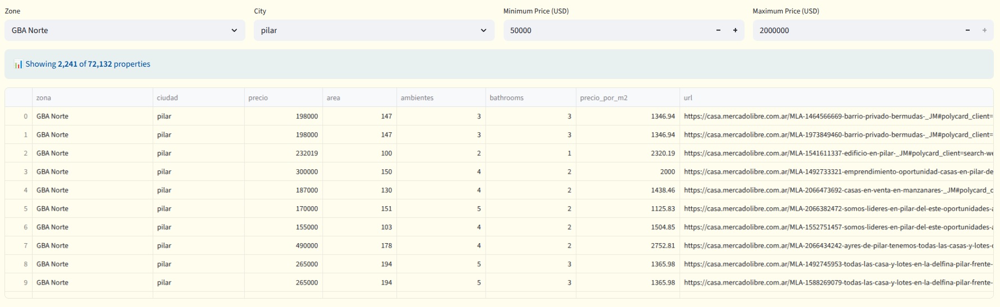
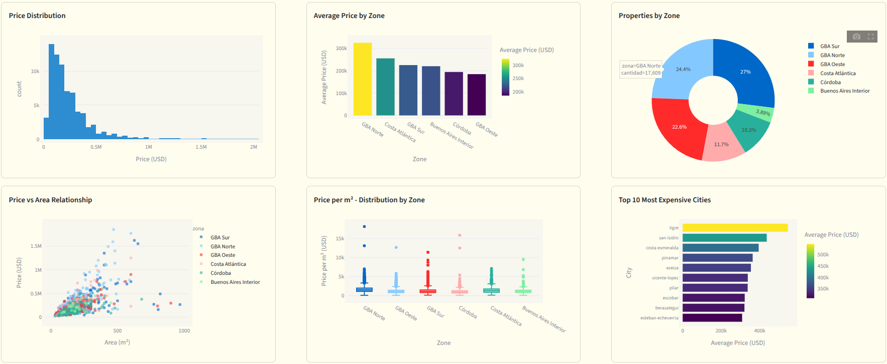

# Argentina Housing Dashboard


Interactive data analytics dashboard for real estate market analysis in Buenos Aires, Argentina.

## Official website

<https://argentina-housing-dashboard.streamlit.app/>

## Features

- **Incremental Data Collection**: Scrapes and updates data from over **72,000+ properties** incrementally to keep the dataset fresh and comprehensive
- **Interactive Visualizations**: Rich charts and graphs for exploring housing market trends
- **Price Analysis**: Statistical analysis of property prices across different neighborhoods and property types
- **Automated Updates**: Scheduled data collection to ensure up-to-date market information
- **Data Exploration**: Deep dive into property characteristics, locations, and pricing patterns

## Project Overview

This project scrapes, analyzes, and visualizes housing data from Mercado Libre to provide insights into the Buenos Aires real estate market. It includes automated data collection, interactive visualizations, and comprehensive data analysis.

## Data Exploration



## Visualizations



## Tech Stack

- **Data Collection**: Python, BeautifulSoup, Selenium
- **Database**: SQLite
- **Dashboard**: Streamlit
- **Deployment**: Streamlit

## Local Setup

### Prerequisites

- Python 3.8+
- pip

### Installation

1. Clone the repository:

```bash
git clone https://github.com/tachyon-lhc/argentina-housing-dashboard.git
cd argentina-housing-dashboard
```

1. Create a virtual environment:

```bash
python -m venv venv
source venv/bin/activate  # On Windows: venv\Scripts\activate
```

1. Install dependencies:

```bash
pip install -r requirements.txt
```

1. Run the dashboard:

```bash
streamlit run app.py
```

The dashboard will be available at `http://localhost:8501`

## Data Pipeline

1. **Scraping**: Automated scripts collect property listings from Mercado Libre
2. **Cleaning**: Data preprocessing removes duplicates and standardizes formats
3. **Storage**: SQLite database for efficient querying
4. **Analysis**: Pandas and visualization libraries for insights
5. **Presentation**: Streamlit dashboard for interactive exploration

## Current Status

- [x] Initial project setup
- [x] Data collection and scraping (72,000+ properties)
- [x] Data cleaning pipeline
- [x] Interactive visualizations
- [x] Dashboard development
- [x] Automated data updates
- [x] Deployment to Streammlit

---

_This project is part of my data analytics portfolio._
